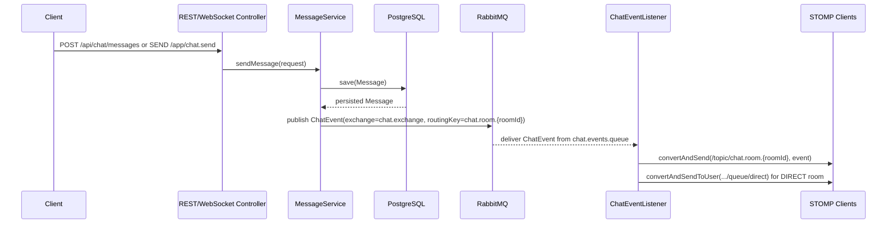
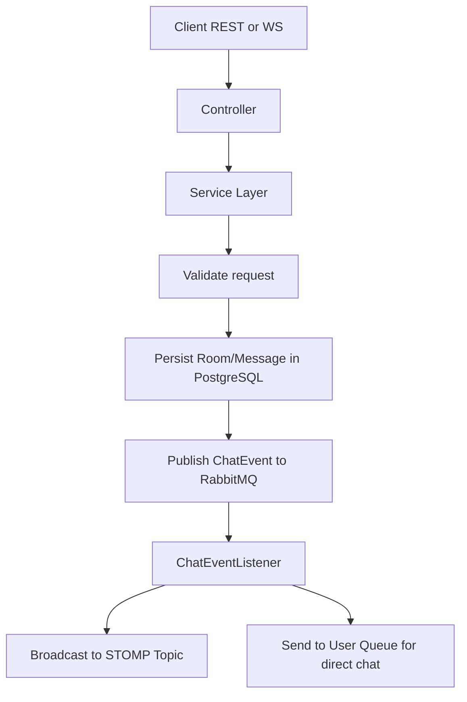

# Chat Service Documentation

## Project Overview

`chat-service` là backend chat realtime xây bằng Spring Boot. Mục tiêu của service là hỗ trợ:

- Tạo phòng chat `1-1` và `group`
- Lưu lịch sử tin nhắn vào database
- Phát tin nhắn realtime qua WebSocket/STOMP
- Dùng RabbitMQ làm message broker trung gian để tách phần xử lý nghiệp vụ và phần phân phối sự kiện realtime

Service này giải quyết hai nhu cầu thường đi cùng nhau trong hệ thống chat:

1. `Persistence`: tin nhắn và phòng chat phải được lưu lại để có thể đọc lịch sử.
2. `Realtime delivery`: cùng một tin nhắn phải được đẩy ngay tới các client đang subscribe.

### Main Technologies

- `Java 17+`
- `Spring Boot 4`
- `Spring Web` cho REST API
- `Spring WebSocket + STOMP` cho realtime communication
- `Spring AMQP` cho tích hợp RabbitMQ
- `Spring Data JPA` cho persistence layer
- `PostgreSQL` cho dữ liệu runtime
- `RabbitMQ` cho AMQP exchange/queue và STOMP broker relay
- `JUnit 5 + Mockito` cho unit test
- `Docker Compose` để dựng PostgreSQL và RabbitMQ local

## Project Structure

```text
chat-service/
├── docker-compose.yml
├── pom.xml
├── DOCUMENTATION.md
├── src/
│   ├── main/
│   │   ├── java/com/project/chat_service/
│   │   │   ├── ChatServiceApplication.java
│   │   │   ├── config/
│   │   │   │   ├── RabbitMQConfig.java
│   │   │   │   └── WebSocketConfig.java
│   │   │   ├── controller/
│   │   │   │   ├── ChatRestController.java
│   │   │   │   └── ChatWebSocketController.java
│   │   │   ├── dto/
│   │   │   │   ├── ChatMessageRequest.java
│   │   │   │   ├── ChatMessageResponse.java
│   │   │   │   ├── ChatRoomResponse.java
│   │   │   │   ├── CreateDirectRoomRequest.java
│   │   │   │   ├── CreateGroupRoomRequest.java
│   │   │   │   └── JoinRoomRequest.java
│   │   │   ├── entity/
│   │   │   │   ├── ChatRoom.java
│   │   │   │   ├── ChatRoomType.java
│   │   │   │   ├── Message.java
│   │   │   │   └── MessageType.java
│   │   │   ├── exception/
│   │   │   │   ├── BadRequestException.java
│   │   │   │   ├── GlobalExceptionHandler.java
│   │   │   │   └── NotFoundException.java
│   │   │   ├── messaging/
│   │   │   │   ├── ChatEvent.java
│   │   │   │   └── ChatEventListener.java
│   │   │   ├── repository/
│   │   │   │   ├── ChatRoomRepository.java
│   │   │   │   └── MessageRepository.java
│   │   │   └── service/
│   │   │       ├── ChatRoomService.java
│   │   │       └── MessageService.java
│   │   └── resources/
│   │       └── application.yaml
│   └── test/
│       └── java/com/project/chat_service/
│           └── ChatServiceApplicationTests.java
└── target/
```

### Core Files and Their Roles

- `pom.xml`: khai báo dependencies và plugin Maven.
- `docker-compose.yml`: dựng PostgreSQL và RabbitMQ, đồng thời bật `rabbitmq_stomp`.
- `application.yaml`: cấu hình port app, PostgreSQL, RabbitMQ và STOMP relay port.
- `config/*`: wiring cho RabbitMQ và WebSocket/STOMP.
- `controller/*`: điểm vào của REST API và WebSocket `@MessageMapping`.
- `service/*`: nơi chứa business logic chính.
- `messaging/ChatEventListener.java`: bridge giữa RabbitMQ event và WebSocket broadcast.
- `entity/*`: mô hình dữ liệu được JPA persist xuống database.
- `repository/*`: truy cập dữ liệu qua Spring Data JPA.
- `test/ChatServiceApplicationTests.java`: kiểm tra các flow nghiệp vụ quan trọng.

## Architecture & Workflow

### High-Level Architecture

Hệ thống có hai đường vào chính:

- `REST API`: dùng để tạo room, gửi tin, join room, đọc lịch sử.
- `WebSocket/STOMP`: dùng để gửi và nhận realtime message.

Phần quan trọng là service không đẩy trực tiếp từ controller ra WebSocket. Thay vào đó:

1. Tin nhắn được validate và persist trước.
2. Sau khi lưu DB, service publish một `ChatEvent` lên RabbitMQ.
3. `ChatEventListener` consume event từ queue.
4. Listener dùng `SimpMessagingTemplate` để push về client qua STOMP topic hoặc user queue.

Thiết kế này giúp tách:

- `business transaction` khỏi `delivery mechanism`
- `data persistence` khỏi `realtime fan-out`

Điều này đặc biệt hữu ích khi về sau cần scale nhiều instance service hoặc thay đổi cách broadcast.

### Component Communication

- `ChatRestController` gọi `ChatRoomService` hoặc `MessageService`
- `ChatWebSocketController` gọi `MessageService`
- `MessageService` lưu `Message` vào PostgreSQL thông qua `MessageRepository`
- `MessageService` publish `ChatEvent` qua `RabbitTemplate`
- `RabbitMQ` route event vào `chat.events.queue`
- `ChatEventListener` nghe queue và push event ra `/topic/chat.room.{roomId}`
- Với room `DIRECT`, listener còn push tới `/user/{participant}/queue/direct`

### Mermaid Sequence Diagram



### Mermaid Flowchart



## Core Logic Explanation

### 1. `ChatRoomService`

File: [src/main/java/com/project/chat_service/service/ChatRoomService.java](C:\Users\Admin\Downloads\chat-service\chat-service\src\main\java\com\project\chat_service\service\ChatRoomService.java)

#### Why direct room creation is implemented this way

Khi tạo room `DIRECT`, service không tạo mới ngay. Nó:

1. chuẩn hóa danh sách participant
2. sort theo thứ tự cố định
3. kiểm tra xem đã có room `DIRECT` nào với đúng 2 participant đó chưa

Lý do:

- chat 1-1 về bản chất là một identity ổn định giữa hai user
- nếu mỗi lần gửi request đều tạo room mới thì lịch sử bị phân mảnh
- việc sort participant giúp `alice-bob` và `bob-alice` được coi là cùng một cặp

Đây là quyết định đúng về mặt domain, không chỉ là xử lý kỹ thuật.

#### Why group room is treated differently

Room `GROUP` luôn tạo mới vì group chat có identity riêng theo ngữ cảnh sử dụng:

- cùng tập participant vẫn có thể đại diện cho nhiều room khác nhau
- room group có `name`, nên thường là một channel độc lập chứ không chỉ là quan hệ giữa user

### 2. `MessageService`

File: [src/main/java/com/project/chat_service/service/MessageService.java](C:\Users\Admin\Downloads\chat-service\chat-service\src\main\java\com\project\chat_service\service\MessageService.java)

Đây là lớp cốt lõi nhất của hệ thống.

#### `sendMessage`

Luồng xử lý:

1. reject nếu `type` không phải `CHAT`
2. reject nếu `content` rỗng
3. load `ChatRoom`
4. kiểm tra `senderId` có thuộc room không
5. lưu `Message`
6. publish `ChatEvent`

Thiết kế này có một chủ đích rõ ràng:

- chỉ broadcast sau khi message đã được persist thành công
- tránh trường hợp client nhận realtime nhưng DB không có dữ liệu
- khiến lịch sử chat là `source of truth`

Nói cách khác, hệ thống ưu tiên tính nhất quán dữ liệu trước, rồi mới realtime.

#### `joinRoom`

`joinRoom` vừa cập nhật participant cho room, vừa tạo một `JOIN` message như một system event.

Lý do:

- join room không chỉ là thay đổi dữ liệu participant
- nó cũng là một sự kiện nghiệp vụ mà client UI có thể hiển thị trong timeline

Việc lưu `JOIN` như một `Message` giúp lịch sử chat phản ánh đầy đủ hành vi của room thay vì chỉ lưu text chat.

### 3. `ChatEventListener`

File: [src/main/java/com/project/chat_service/messaging/ChatEventListener.java](C:\Users\Admin\Downloads\chat-service\chat-service\src\main\java\com\project\chat_service\messaging\ChatEventListener.java)

Lớp này là cầu nối giữa RabbitMQ và WebSocket.

#### Why use a listener instead of broadcasting directly in service

Nếu `MessageService` gọi `SimpMessagingTemplate` trực tiếp, code sẽ đơn giản hơn trong ngắn hạn. Tuy nhiên việc dùng `RabbitListener` có lợi ích dài hạn:

- service chỉ chịu trách nhiệm xử lý nghiệp vụ
- broadcast trở thành một consumer riêng
- dễ scale nhiều consumer hoặc thay đổi cách phân phối event
- giảm coupling giữa transaction và network push

Đây là mô hình phù hợp hơn cho hệ thống realtime có khả năng mở rộng.

#### Topic vs User Queue

- `/topic/chat.room.{roomId}`: broadcast cho mọi client đang subscribe room
- `/user/queue/direct`: dùng cho direct chat nếu cần delivery riêng tới từng user

Hiện tại code gửi cả hai cho room `DIRECT`, điều này giúp linh hoạt cho frontend:

- UI theo room có thể nghe topic
- UI theo inbox/user-specific notification có thể nghe user queue

### 4. `WebSocketConfig`

File: [src/main/java/com/project/chat_service/config/WebSocketConfig.java](C:\Users\Admin\Downloads\chat-service\chat-service\src\main\java\com\project\chat_service\config\WebSocketConfig.java)

#### Key decisions

- `enableStompBrokerRelay("/topic", "/queue")`: không dùng in-memory broker, mà relay qua RabbitMQ STOMP
- `setApplicationDestinationPrefixes("/app")`: client gửi message nghiệp vụ vào controller qua prefix `/app`
- `setUserDestinationPrefix("/user")`: hỗ trợ user-specific destination
- endpoint `/ws` có cả native WebSocket và SockJS fallback

Điểm cần lưu ý:

- Broker relay yêu cầu RabbitMQ mở STOMP plugin ở port `61613`
- Với Spring Boot 4, relay cần thêm `spring-boot-starter-reactor-netty` để đủ runtime dependency cho TCP client

### 5. `RabbitMQConfig`

File: [src/main/java/com/project/chat_service/config/RabbitMQConfig.java](C:\Users\Admin\Downloads\chat-service\chat-service\src\main\java\com\project\chat_service\config\RabbitMQConfig.java)

Config này tạo:

- `TopicExchange`: `chat.exchange`
- queue durable: `chat.events.queue`
- binding pattern: `chat.room.#`

Ý nghĩa của wildcard routing key:

- mỗi room publish với key dạng `chat.room.{roomId}`
- listener không cần biết trước room nào sẽ được tạo
- chỉ một binding pattern là đủ nhận sự kiện từ mọi room

Đây là lựa chọn hợp lý cho chat room vì số lượng room là động.

## Data Model

### `ChatRoom`

- `id`: khóa chính
- `type`: `DIRECT` hoặc `GROUP`
- `name`: tên room, đặc biệt hữu ích cho group
- `participantIds`: tập user thuộc room
- `createdAt`, `updatedAt`: audit fields

### `Message`

- `id`: khóa chính
- `chatRoom`: liên kết tới room
- `senderId`: user gửi
- `content`: nội dung
- `type`: `CHAT` hoặc `JOIN`
- `sentAt`: thời điểm gửi

### Why participant IDs are stored as `ElementCollection`

Ở phiên bản hiện tại, room chỉ cần biết danh sách participant dưới dạng string ID. Chưa cần entity `User` riêng trong service này.

Lợi ích:

- giảm coupling với user-service hoặc auth-service
- phù hợp với kiến trúc microservice khi user profile nằm ở service khác
- đủ để validate sender và fan-out theo participant

Trade-off:

- không có foreign key tới bảng user
- nếu về sau cần metadata participant theo room, nên refactor sang entity riêng

## API Surface

### REST Endpoints

| Method | Path | Purpose |
|---|---|---|
| `POST` | `/api/chat/rooms/direct` | tạo hoặc reuse room 1-1 |
| `POST` | `/api/chat/rooms/group` | tạo group room |
| `GET` | `/api/chat/rooms` | lấy danh sách room |
| `GET` | `/api/chat/rooms/{roomId}` | lấy chi tiết room |
| `GET` | `/api/chat/rooms/{roomId}/messages` | lấy lịch sử tin nhắn |
| `POST` | `/api/chat/messages` | gửi tin nhắn qua REST |
| `POST` | `/api/chat/rooms/join` | thêm user vào room và tạo event `JOIN` |

### WebSocket/STOMP Endpoints

- WebSocket endpoint: `ws://localhost:8080/ws`
- Client send:
  - `/app/chat.send`
  - `/app/chat.join`
- Client subscribe:
  - `/topic/chat.room.{roomId}`
  - `/user/queue/direct`

## Setup & Testing Guide

### Prerequisites

- JDK `17` hoặc cao hơn
- Maven Wrapper dùng sẵn trong repo
- Docker Desktop hoặc Docker Engine

### Environment Setup

1. Dựng PostgreSQL và RabbitMQ:

```powershell
docker compose up -d
```

2. Kiểm tra service nền:

- PostgreSQL: `localhost:5433`
- RabbitMQ AMQP: `localhost:5672`
- RabbitMQ STOMP: `localhost:61613`
- RabbitMQ Management UI: `http://localhost:15672`

3. Credentials mặc định:

- PostgreSQL
  - user: `postgres`
  - password: `123456`
  - db: `chat_db`
- RabbitMQ
  - user: `guest`
  - password: `guest`

### Run the Application

Chạy app ở chế độ development:

```powershell
.\mvnw.cmd spring-boot:run
```

Hoặc build jar rồi chạy:

```powershell
.\mvnw.cmd package -DskipTests
java -jar target\chat-service-0.0.1-SNAPSHOT.jar
```

App mặc định chạy ở:

- `http://localhost:8080`

Lưu ý:

- `GET /` hiện không có controller, nên trả `404` là đúng
- endpoint thực tế bắt đầu bằng `/api/chat`

### Run Automated Tests

```powershell
.\mvnw.cmd test
```

Các test hiện tại xác nhận:

- direct room được reuse thay vì tạo trùng
- gửi message sẽ persist và publish RabbitMQ event
- join room sẽ thêm participant và phát event `JOIN`

## Manual Test Cases

### Test Case 1: Create Direct Room and Send Message via REST

#### Input

Tạo room:

```http
POST /api/chat/rooms/direct
Content-Type: application/json

{
  "firstParticipantId": "alice",
  "secondParticipantId": "bob"
}
```

Gửi tin:

```http
POST /api/chat/messages
Content-Type: application/json

{
  "roomId": "<ROOM_ID>",
  "senderId": "alice",
  "content": "hello bob",
  "type": "CHAT"
}
```

#### Steps

1. Tạo direct room bằng Postman
2. Lưu `roomId` từ response
3. Gửi message vào room vừa tạo
4. Gọi `GET /api/chat/rooms/{roomId}/messages`

#### Expected Output

- request tạo room trả `201`
- response room có `type = DIRECT`
- request gửi tin trả `201`
- lịch sử room chứa message `"hello bob"`
- nếu gọi lại tạo room với `bob` và `alice`, response vẫn trả cùng `roomId`

### Test Case 2: Group Chat Join Flow

#### Input

Tạo group:

```http
POST /api/chat/rooms/group
Content-Type: application/json

{
  "name": "backend-team",
  "participantIds": ["alice", "bob", "carol"]
}
```

Join room:

```http
POST /api/chat/rooms/join
Content-Type: application/json

{
  "roomId": "<GROUP_ROOM_ID>",
  "userId": "dave"
}
```

#### Steps

1. Tạo group room
2. Gọi API join bằng user `dave`
3. Đọc lại room bằng `GET /api/chat/rooms/{roomId}`
4. Đọc message history

#### Expected Output

- room có `type = GROUP`
- sau khi join, `participantIds` chứa `dave`
- response join có `type = JOIN`
- history có một system-like message với nội dung `"dave joined the room"`

### Test Case 3: End-to-End Realtime WebSocket Flow

#### Input

WebSocket URL:

```text
ws://localhost:8080/ws
```

Frame connect:

```text
CONNECT
accept-version:1.2
host:/

^@
```

Frame subscribe:

```text
SUBSCRIBE
id:sub-0
destination:/topic/chat.room.<ROOM_ID>

^@
```

Frame send:

```text
SEND
destination:/app/chat.send
content-type:application/json

{"roomId":"<ROOM_ID>","senderId":"alice","content":"hello realtime","type":"CHAT"}^@
```

#### Steps

1. Tạo room trước bằng REST
2. Mở WebSocket client
3. Gửi frame `CONNECT`
4. Gửi frame `SUBSCRIBE`
5. Gửi frame `SEND` hoặc gửi message qua REST

#### Expected Output

- client nhận frame `CONNECTED`
- sau khi gửi tin, client nhận frame `MESSAGE`
- payload chứa `roomId`, `senderId`, `content`
- gọi lại API lịch sử sẽ thấy cùng message đó đã được lưu DB

## Common Troubleshooting

### `404` at `/`

Đây là hành vi đúng. Project không expose UI hoặc root endpoint. Hãy dùng:

- `GET /api/chat/rooms`
- `POST /api/chat/rooms/direct`

### `405 Method Not Allowed` at `/api/chat/rooms`

Bạn đang dùng sai HTTP method. Endpoint này chỉ hỗ trợ:

```http
GET /api/chat/rooms
```

### WebSocket connects but no message is received

Kiểm tra:

- đã subscribe đúng `/topic/chat.room.{roomId}`
- `roomId` trong frame send là đúng
- `senderId` thuộc room
- RabbitMQ STOMP plugin đã bật và port `61613` đang mở

### App fails on STOMP broker relay startup

Kiểm tra:

- RabbitMQ container đang chạy
- port `61613` đã expose
- dependency `spring-boot-starter-reactor-netty` còn trong `pom.xml`

### Sender is not a participant

Lỗi này là cố ý để bảo vệ dữ liệu nghiệp vụ. Trước khi gửi tin:

- user phải thuộc `participantIds` của room
- hoặc cần gọi `/api/chat/rooms/join` trước với group room

## Suggested Next Improvements

- thêm Swagger/OpenAPI để dễ khám phá API
- thêm root endpoint hoặc health endpoint như `/health`
- thêm integration test với PostgreSQL/RabbitMQ thật bằng Testcontainers
- bổ sung auth và map `senderId` từ token thay vì tin client gửi lên
- thêm read receipt, leave event, typing indicator
- tách `User` thành service riêng nếu hệ thống mở rộng

## Summary

Codebase hiện tại được tổ chức theo hướng khá rõ ràng:

- `controller` nhận request
- `service` xử lý nghiệp vụ
- `repository` persist dữ liệu
- `RabbitMQ` mang event
- `ChatEventListener` đẩy dữ liệu realtime ra STOMP

Điểm quan trọng nhất để hiểu hệ thống là: `tin nhắn được lưu trước, rồi mới broadcast`. Đây là quyết định kiến trúc giúp dữ liệu lịch sử và realtime luôn bám cùng một nguồn sự thật.
