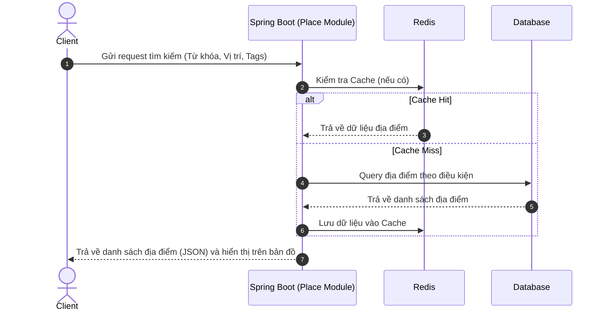
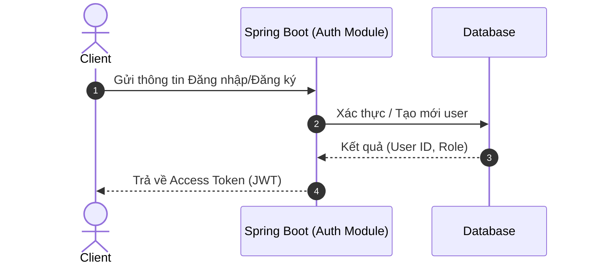
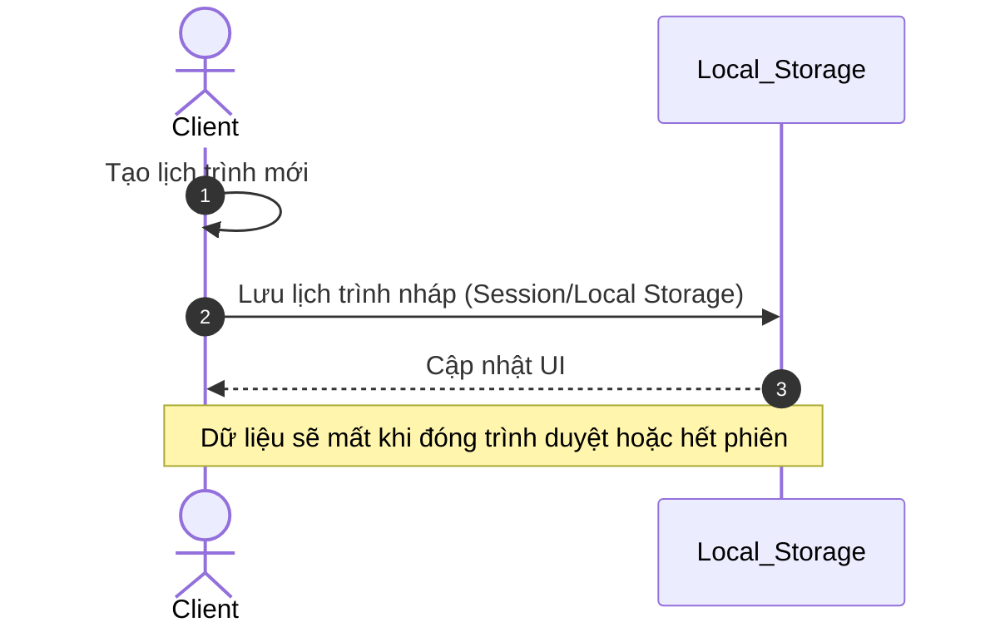
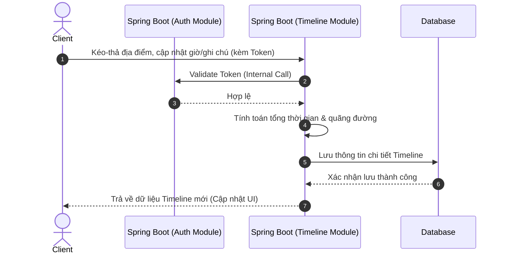
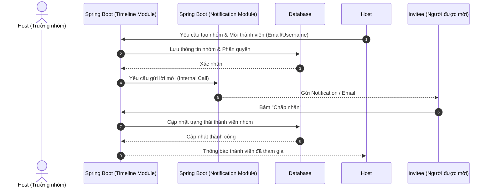
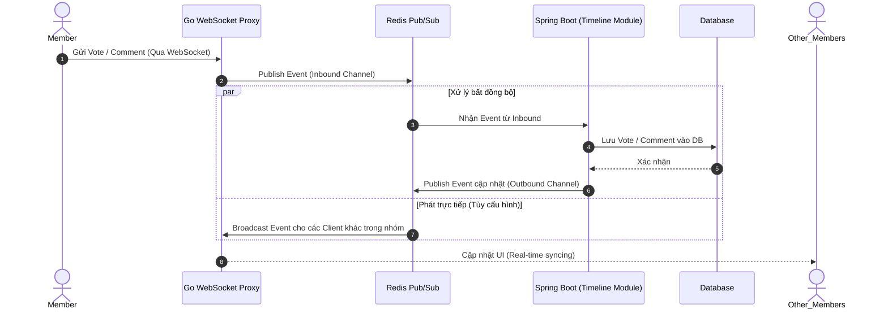
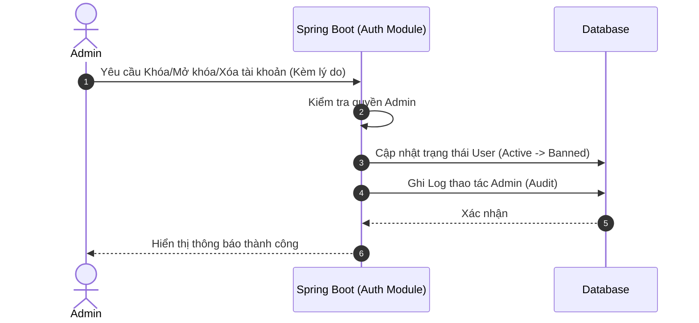
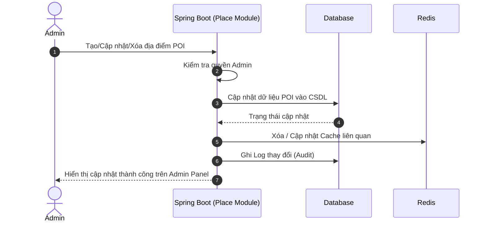

# Lược đồ tuần tự (Sequence Diagrams) cho các Use Cases

Dựa trên tài liệu `bao_cao_usergroup_usecase.pdf` và kiến trúc hiện tại của dự án trên nhánh `main`, dưới đây là danh sách các lược đồ tuần tự (Sequence Diagrams) sử dụng cú pháp Mermaid để hiện thực hóa các Use Cases.

## Các Components & Modules (Dựa trên nhánh `main`):
- **Client**: Ứng dụng Frontend (Web/App)
- **Spring Boot Backend**: Backend nguyên khối (Monolith) xử lý chính, bao gồm các modules:
  - **Auth Module**: Xác thực và quản lý người dùng
  - **Place Module**: Quản lý dữ liệu địa điểm du lịch (POI)
  - **Timeline Module**: Quản lý lịch trình, chuyến đi, và nhóm du lịch
  - **Notification Module**: Xử lý gửi thông báo
- **Go WebSocket Proxy**: Tầng proxy xử lý kết nối WebSocket thời gian thực (Chat, Tương tác)
- **Database**: Hệ quản trị cơ sở dữ liệu PostgreSQL
- **Redis**: Bộ nhớ cache và hỗ trợ Pub/Sub kết nối giữa Go Proxy và Spring Boot

---

## 1. UC01: Tìm kiếm & Lọc địa điểm (Khách vãng lai & Thành viên)

---

## 2. UC02 & UC03: Đăng nhập/Đăng ký & Tạo lịch trình nháp

### Đăng ký / Đăng nhập

### Tạo lịch trình nháp (Khách vãng lai)

---

## 3. UC04: Quản lý Lộ trình / Timeline chuyến đi (Thành viên cá nhân)

---

## 4. UC05: Tạo và Quản lý Nhóm du lịch (Nhóm du lịch)

---

## 5. UC06: Tương tác & Biểu quyết nhóm (Real-time)

---

## 6. UC07: Quản lý Tài khoản người dùng (System Admin)

---

## 7. UC08: Quản lý Dữ liệu Địa điểm - POI (System Admin)

